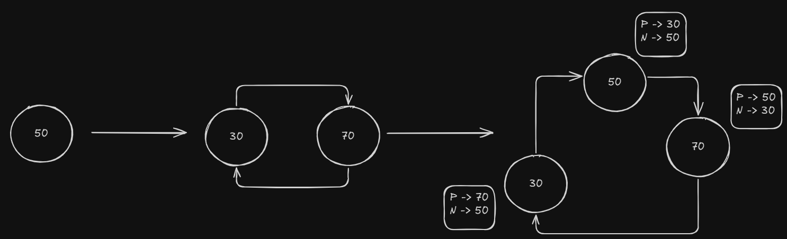

# Projeto da disciplina MCTA025-13-Sistemas Distribuidos UFABC - 2024
## Autores: 
- Paulo Alexandre Pizará Hayashida RA: 11201722652
- Igor Ladeia de Freitas RA: 11201922180

# Rede DHT
## Funcionamento

### Join

Quando um novo nó deseja entrar na rede DHT o novo nó utiliza dhtList.txt para tentar encontrar algum nó da rede através de uma chamada rpc hello, as seguintes condições são possiveis.

- Caso nenhum nó responda, o novo nó inicia um servidor e define seus nós anterior e posterior como ele mesmo.


- Caso algum nó responda, mas esse nó sejá o único nó da rede, o mesmo irá responder o nó que esta tentando entrar na rede, isso acontece mesmo que o id do nó ingressante sejá maior que o id do nó na rede. O nó da rede informa para o nó ingressante que ele deve entrar na rede com seu anterior e posterior com o id do nó que já estava na rede, em seguida o nó que já estava na rede registra o novo nó como seu anterior. Quando o nó que esta tentando ingressar recebe a resposta pela chama rpc join_response ele entra na rede e informa seu anterior para atualizar seu atributo posterior para seu id.


- Caso a rede possua 2 ou mais nós, se o id do nó ingressante for menor do que o id do nó que recebe a requisição, esse nó responde o nó diretamente, caso contrario encaminha a requisição para o seu nó posteior.



### Leave

### Store

### Retrive

### Comandos Terminal
#### Instalar protobuf compiler
```
 sudo apt install protobuf-compiler
```
### Python
#### Comando para instalar gRPC tools
 ```
 pip install grpcio-tools 
```
#### Comando para instalar psycopg2
 ```
 pip install psycopg2-binary
```
#### Gerar protobuf e stubs em python
```
 python3 -m grpc_tools.protoc -I. --python_out=.  --grpc_python_out=.  protos/dht.proto
```
